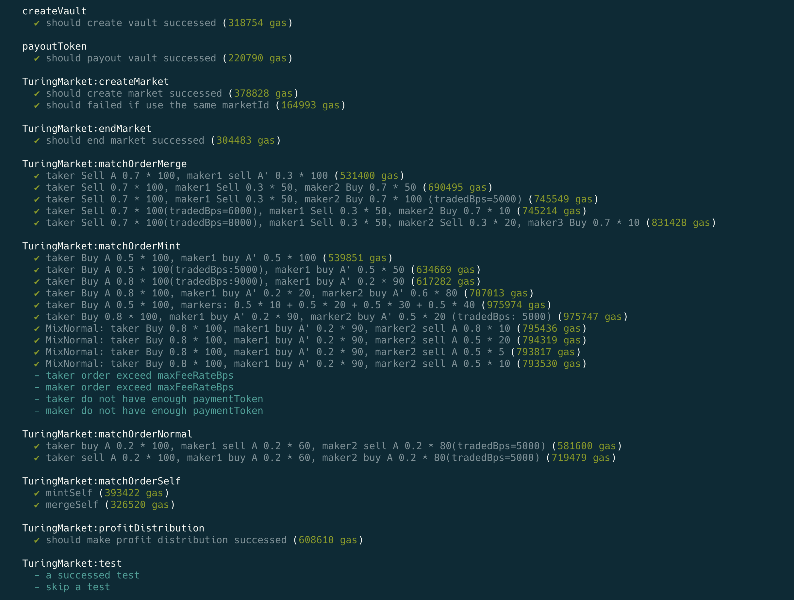
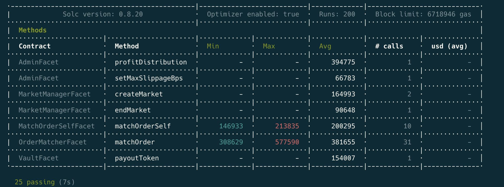

# TuringM-EIP2535-SmartContract

The current codebase contains most of the program logic. Only minor modifications are expected in the future (permission-related code updates, very limited program logic changes, bug fixes).

We already have 25 test cases(most of them are for the order match logic).
We still adding more test cases to ensure the correctness of the program logic.
Currently, we do not provide any test cases yet, after we decide the final audit firm, we will provide the test cases.

## Audit Firms

We are looking for 1-2 smart contract audit firms to audit this codebase.

Please provide:

1. Complete smart contract audit quotation
2. Comprehensive audit process
3. Separate audit quotations for the 3 directories: contract1, contract2, contract3
 - the audit total price for each directory
 - the audit working days required for each directory
4. Maybe more additional information you think is necessary

Please send the reply to the email security@TuringM.io